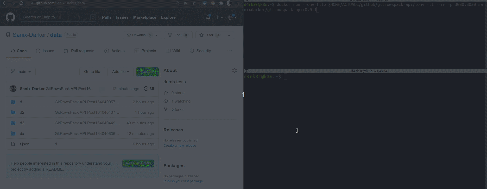
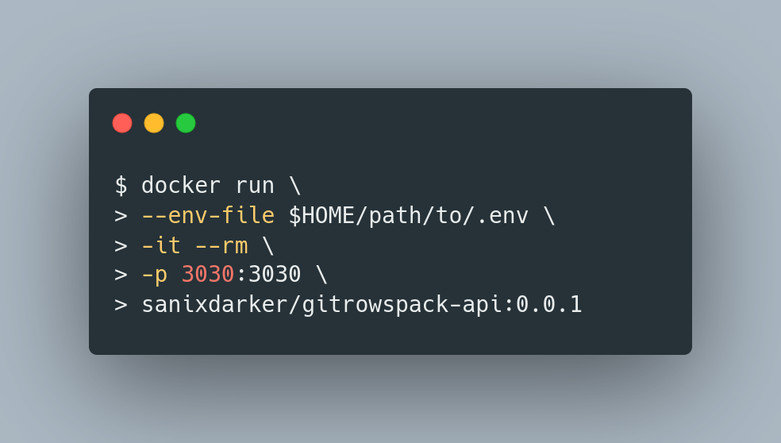

# GitRowsPack-Api

Soooo, what's is gitrowspack-api in a simple sentence, it's a service interface for your (github/gitlab) repository oriented for Database !

It support json, csv and yaml file, but as default, we will be using the json.

The purpose of this project is to have a full quick running gitrows's api instance if we have our own private repos that we want to transform as storage !




## Disclaimers
This project is for certain usecases... the github API cache is HUGE, like 4/5mins, so this is not a realtime stuff, you can used in your project... but it does the job... and well !

**This is a node-rest-api project inspired from an amazing npm package [gitrows](https://www.npmjs.com/package/gitrows) made by [Nicolas-Zimmer](https://github.com/nicolaszimmer) long time ago !**

**__With a lot of improvements and bugs fixes (due to github api changes) !__**

## Requirements
#### For prod
- Docker

#### For Dev
- node/npm (see the package.json for libs)
- Docker (optionnal)

## Features
Transform your github repo into a NoSQl database 


## How to set up

First, you need to create a repository in your github/gitlab profile, you can call it 'data' or whatever... but keep in mind that, each directory in your project will be a 'database' and inside there will be an 'o.json' file that will represent your collection !

Second, you just have to follow those instructions
```bash
cd to/a/random/dir
# get the environment sample file:
wget -o .env \
https://raw.githubusercontent.com/Sanix-Darker/gitrowspack-api/master/.env.example

# or you can clone the project and do a copy
# cp .env.example .env

# and provide valids parameters inside
# GITHUB_OWNER is your github username
# GITHUB_TOKEN is a github access token you can create from your settings easily: https://github.com/settings/tokens 

# And you're all set :-)
```

## How to start it
### For prod



```bash
# This will pull an image of gitrowspack and start it
docker run \
--env-file .env \
-it --rm \
-p 3030:3030 \
sanixdarker/gitrowspack-api:latest

# expected output
# Unable to find image 'sanixdarker/gitrowspack-api:0.0.1' locally
# 0.0.1: Pulling from sanixdarker/gitrowspack-api
# 482c96fb3fd1: Already exists 
# 8a46b85b8b61: Pull complete 
# 1a99571c09c9: Pull complete 
# e7276d16c1c3: Pull complete 
# 1d5b7776a505: Pull complete 
# Digest: sha256:72dbcfa96ca59ad684c62dfe3e72b2d35e6c5a7e0024c5331b005f36be122d72
# Status: Downloaded newer image for sanixdarker/gitrowspack-api:0.0.1
# GitRowsPack-Api started at http://localhost:3030

# For security, make sure the Digest hash you got match the version from the 'digest.json' file or from [dockerhub](https://hub.docker.com/repository/docker/sanixdarker/gitrowspack-api/general)
```

### For dev
```bash
# You can build the image locally yourself
docker build --no-cache -t sanixdarker/gitrowspack-api:0.0.1 -f Dockerfile .
# And then run it locally with a valid .env
docker run --env-file .env --rm -p 3030:3030 sanixdarker/gitrowspack-api:0.0.1

# ----------------------------------------------------
# Or just start it manually
npm install
npm start # node index.js
```

## API Documentation
You can check the API-Documentation [HERE](https://documenter.getpostman.com/view/2696027/UVREijCS)
Under a [MIT](LICENSE).


## Author

- Sanix-darker
